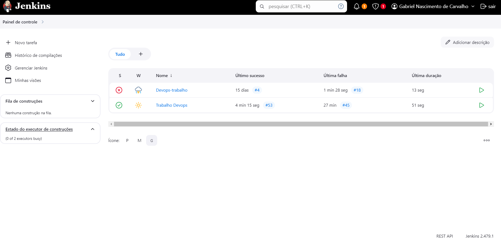
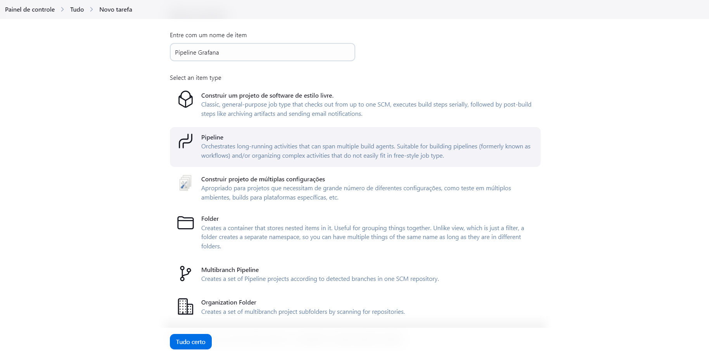
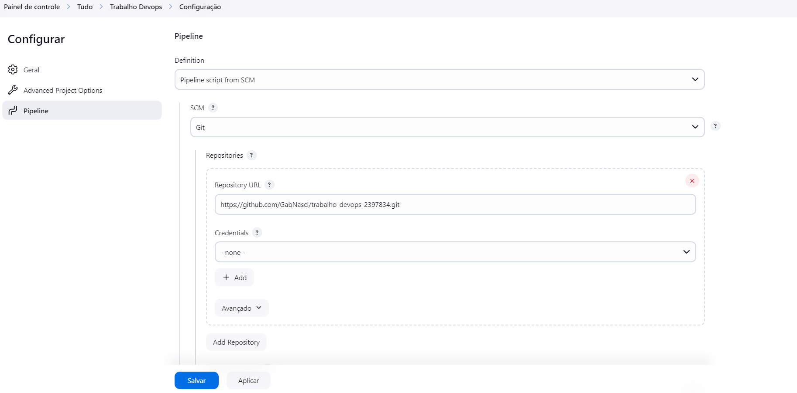
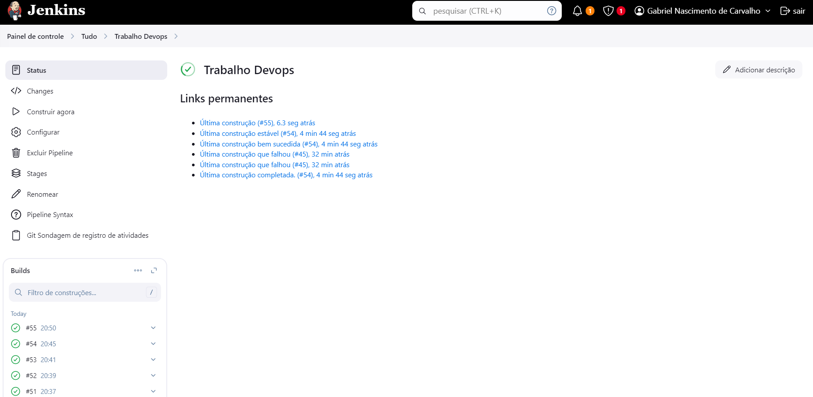
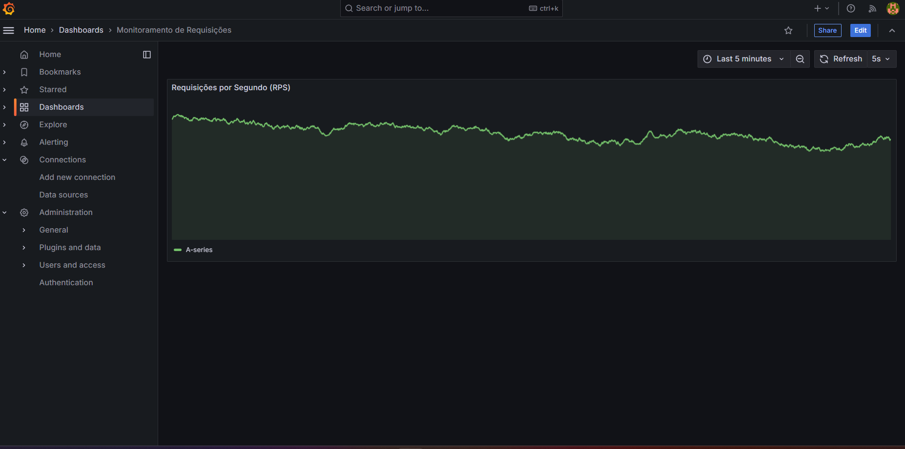

# **Documentação do Projeto**

**Autor**: Gabriel Nascimento de Carvalho  
**RA**: 239783-4  

---

## **Descrição**

Este projeto provisiona automaticamente um ambiente de monitoramento usando o Grafana, configurado para exibir um dashboard que monitora requisições de um servidor Prometheus. A automação inclui a integração com Jenkins para gerenciamento do pipeline de execução.

---

## **Pré-requisitos**

1. **Jenkins** instalado e em execução.
2. **Docker** e **Docker Compose** configurados no ambiente do Jenkins.
3. Acesso ao navegador para visualizar o Grafana no endereço `http://localhost:3000`.

---

## **Passos para Configurar e Executar o Projeto**

### **1. Iniciar o Jenkins**
   - Certifique-se de que o Jenkins está em execução. Normalmente, ele estará disponível em `http://localhost:8080`.

---

### **2. Criar uma Nova Pipeline no Jenkins**

1. **Acessar o Jenkins**
   - Vá até o Jenkins em `http://localhost:8080` e faça login.

   **Exemplo de Tela Inicial do Jenkins:**
   

2. **Criar um Novo Item**
   - Clique em **"Nova Tarefa"**.
   - Digite um nome para o pipeline, como `Pipeline-Grafana`.
   - Selecione a opção **"Pipeline"** e clique em **"OK"**.

   **Exemplo de Criação de Pipeline:**
    

3. **Configurar o Pipeline**
   - Na página de configuração do pipeline:
     - Role até a seção **Build Triggers** e selecione **Consultar periodicamente o SCM**
     - Adicione o seguinte texto para que o jenkins verifique o repositório periódicamente: `H/5 * * * *`
     - Role até a seção **Pipeline** e selecione a opção **Pipeline Script from SCM**.

   **Exemplo de Configuração de Pipeline:**
   

4. **Configurar Repositório SCM**
   - Em **SCM**, selecione **Git**.
   - Insira o repositório Git onde o projeto está hospedado: `https://github.com/GabNasci/trabalho-devops-2397834.git`.
   - Configure as credenciais, se necessário.
   - Clique em **Salvar**.

---

### **3. Executar o Pipeline**

1. Volte para a página inicial do Jenkins e clique na pipeline recém-criada.
2. Clique em **"Construir Agora"** para iniciar o pipeline.
3. Monitore a execução:
   - Acompanhe os logs para verificar se os containers Docker (Prometheus, Grafana) foram provisionados corretamente.
   - Certifique-se de que a etapa final indica que o serviço Grafana está em execução.

    **Exemplo da Tela da Pipeline:**
   
---

### **4. Acessar o Grafana**

1. Abra o navegador e vá para `http://localhost:3000`.
2. Faça login no Grafana:
   - **Usuário**: `admin`  
   - **Senha**: `admin` (ou a configurada no ambiente).
3. Verifique o dashboard provisionado automaticamente e visualize as métricas de requisições.

   **Exemplo de Dashboard no Grafana:**
   

---

## **Resumo dos Passos**

1. Certifique-se de que o Jenkins está rodando.
2. Crie uma nova pipeline no Jenkins seguindo as instruções acima.
3. Execute a pipeline.
4. Acesse o Grafana em `http://localhost:3000` e explore o dashboard.

---

Se houver dúvidas ou problemas, entre em contato. 😊